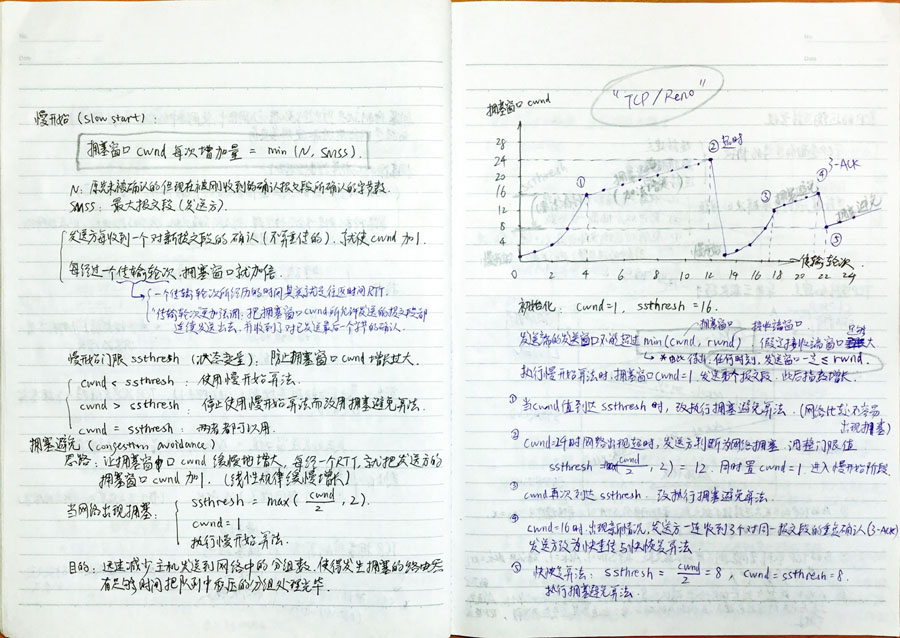
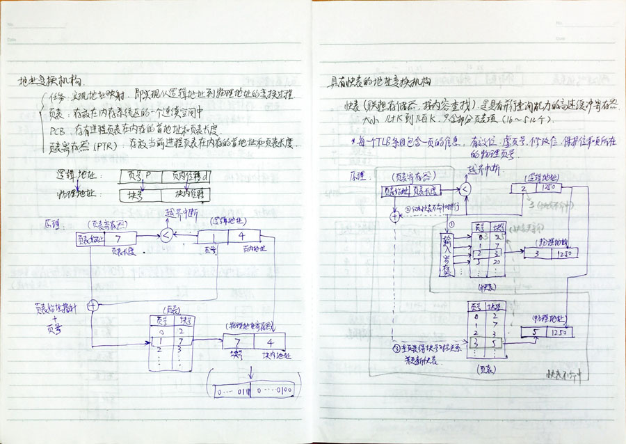
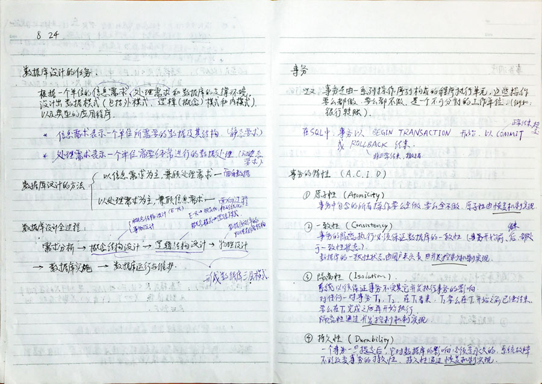

# CS-notes

A set of notes about computer science major: basics &amp; professional core.

### Contents

* 20170807 高等数学

* 20170901 线性代数 概率论与数理统计

* 20180822 数据库概论

* 20180828 操作系统

* 20180904 计算机网络

### Glance

> More notes coming soon...